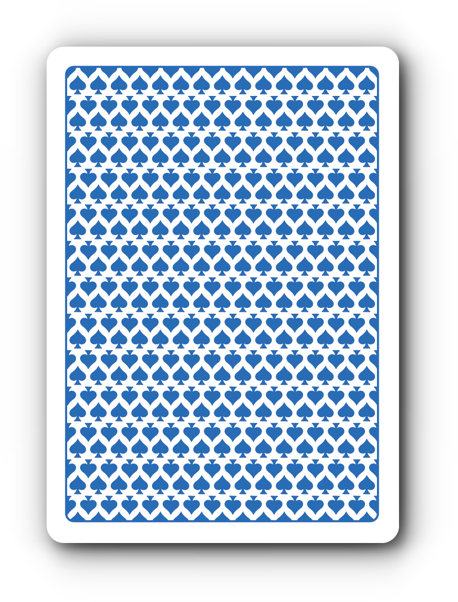

# magic-memory

### https://magicmemory.netlify.app/

## Magic Memory Game

- A card memory game, match cards that are the same to win!
- This app was built with react
- I built this app with help from the [Net Ninja](https://www.youtube.com/watch?v=ZCKohZwGZMw&list=PL4cUxeGkcC9iQ7g2eoNXHCJBBBz40S_Lm 'Net Ninja Youtube Channel') watch his videos and tutorials to build apps like this.

 

## Usage

### `npm install`

### `npm start`

Runs the app in the development mode. 
Open [http://localhost:3000](http://localhost:3000)

### `npm run build`

Builds the app for production to the `build` folder. 
